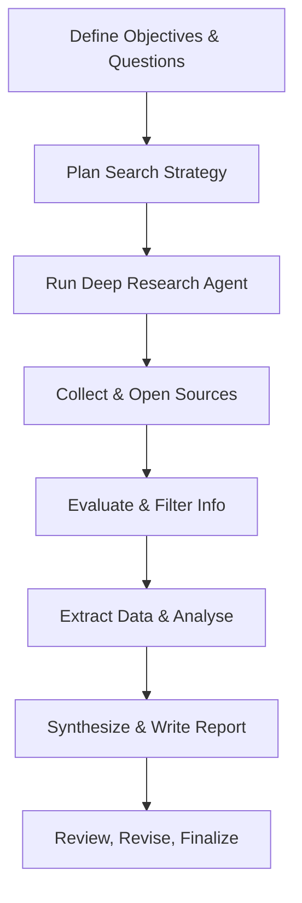
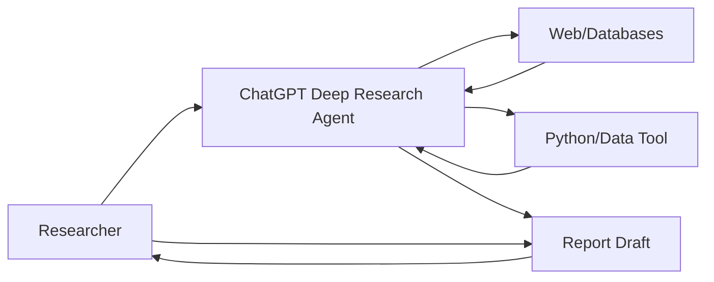

# Deep Research Skill: A Comprehensive Guide

**Executive Summary:** The Deep Research skill enables a researcher to offload extensive, multi-step investigation to an AI agent (ChatGPT’s Deep Research mode), synthesizing insights from diverse online sources into a cohesive, citation-backed report.  By defining clear objectives and questions, the researcher leverages the assistant’s planning, web browsing, and analysis tools to collect and evaluate hundreds of documents.  This process, analogous to a systematic review but much faster, emphasizes transparency, evidence-based decision rules, and rigorous documentation. The following manual details **purpose and scope**, **methodology and decision rules**, **tools and sources**, **quality-control checks**, **reproducibility and documentation practices**, **ethical/legal issues**, **limitations**, **sample workflows and templates**, **time/resource estimates**, and **success metrics**.  

## Purpose and Scope  
The **Deep Research** skill is designed to perform in-depth online research for complex queries, synthesizing information across domains (finance, science, policy, engineering, product analysis, etc.) with human-level thoroughness but in minutes.  Unlike a quick Q&A or a conversational AI, Deep Research conducts extensive exploration of publications, news, data, and code, producing a fully-documented report with explicit citations for every claim.  This skill is useful whenever tasks require *comprehensive evidence-gathering* – for example, a competitive market analysis, literature review on a niche topic, or investigative research – essentially any scenario where a systematic, evidence-based approach is needed.  Its scope is broad (no fixed domain), but it focuses on **public, authoritative sources**.  By default, it searches the open web and can also ingest user-provided files. Recent updates even allow restricting searches to trusted domains to prioritize “authenticated, industry-standard sources”.  In short, Deep Research is suitable for multi-faceted questions that demand depth and precision, delivering what might take many hours of human effort.  

## Methodology  

1. **Define Objectives & Key Questions:**  Begin by articulating a clear research problem or question.  Specify the scope, definitions, and any assumptions.  For example, if analyzing “electric vehicle market share in India”, define terms (e.g. EV categories) and subquestions (market size, trends, regulations).  This mirrors systematic review practice: a precise question guides a thorough literature search.  Document the objectives in a *Research Plan* (see template below), including background, hypotheses, and proposed sub-questions.  

2. **Develop Search Strategy:**  Identify keywords, synonyms, and relevant concepts.  Plan which databases and sources to query (academic engines, news sites, official databases).  Consider Boolean logic, filters (date, region, language), and any controlled vocabularies (e.g. MeSH terms in medicine).  Record the planned search queries.  The Deep Research agent will use these or generate refined queries in real time.  Prioritize *primary and authoritative sources*: peer-reviewed journals, official reports, industry white papers, and reputable news outlets.  As a decision rule, prefer official data over unverified claims.  (Deep Research can be set to only use pre-approved domains, ensuring quality.)  

3. **Initiate Deep Research Agent:**  In the ChatGPT interface, select **“Deep Research”** mode.  Provide the research question, context, and any attached data/files (e.g. spreadsheets, PDFs) for background.  Optionally give instructions on focus areas or excluded content.  The agent will start executing a multi-step plan.  A sidebar (or log) appears, summarizing each action (web searches, pages opened, code executed) and listing sources used.  You can monitor progress, and even interrupt to refine or redirect the search if needed (for example, to add a new keyword or ask a follow-up).  Recent versions allow real-time progress tracking and interactive refinements.  

4. **Source Retrieval & Browsing:**  The agent performs iterative web searches, opening relevant documents (web pages, PDFs, databases) using its browser tool.  It uses reasoning to decide what links to follow, “pivoting as needed” based on findings.  It collects candidate sources that meet inclusion criteria (e.g. recent, relevant, high-quality).  The researcher should verify that it is indeed finding diverse and authoritative sources.  For example, if only blog posts appear, instruct it to seek peer-reviewed or official data.  All visited sources are logged for later citation.  

5. **Evaluate & Filter Sources:**  As the agent gathers information, apply decision rules to filter evidence.  Check each source’s credibility: author reputation, publication venue, date, and methodology.  Discard duplicated or outdated info.  If sources conflict, note all perspectives.  (For instance, if two studies disagree, the agent should ideally report both and possibly weigh their trustworthiness.)  This quality-control step ensures results aren’t skewed by low-quality content.  The assistant may ask clarifying prompts or retrieve additional sources to resolve discrepancies.  

6. **Data Extraction and Analysis:**  From each relevant source, the agent extracts key data points and quotations.  It can use built-in tools to process data: running custom code (e.g. Python) to compute statistics or generate charts from numerical data.  For example, it might parse tables from a PDF or perform calculations.  It can also create or update spreadsheets if needed.  Throughout, every fact or figure is tagged with its source reference.  Maintain structured notes (a *Data Extraction Sheet*) capturing each study’s details (see template below).  Apply the same data-extraction and interpretation rigor as a systematic review, including recording methods, outcomes, and sample sizes for studies.  

7. **Synthesis and Writing:**  Once enough evidence is gathered, the agent organizes findings into a structured report.  It typically includes an introduction, subheadings for themes or sub-questions, and a conclusion.  It summarizes evidence, contrasts viewpoints, and draws reasoned conclusions.  Crucially, each claim is backed by in-text citations: e.g. “Study X found …,” or “According to official data, ….”  The agent even provides a *summary of its reasoning* alongside the final report, enhancing transparency.  The output is akin to a draft of an academic review paper or professional briefing.  If needed, one can iterate: ask for clarifications, additional sources, or elaboration on weak points.  

8. **Review and Validation:**  After generation, the researcher must critically review the report.  Check that all citations correspond to the right statements, verify the context of quotes, and ensure no hallucinations slipped in.  Cross-validate key facts (e.g. by spot-checking source contents).  Consider soliciting peer feedback or testing the findings against known benchmarks.  Incorporate any missing details or correct errors.  The final output should be a polished, self-contained report with complete citations and references.  

```


## Decision Rules  
Throughout the research, apply clear decision rules to maintain rigor:

- **Source Credibility:** *Rule:* Prioritize primary, peer-reviewed, and official sources (government databases, academic journals) over secondary or user-generated content.  If a claim is only found in a questionable source, either find corroboration or exclude it.  
- **Bias Detection:** If multiple sources disagree, do not cherry-pick. Report all credible perspectives.  For example, if two studies conflict, summarize both and note which has stronger methodology (as Cochrane practice suggests using multiple raters to resolve disagreements).  
- **Inclusion/Exclusion Criteria:** Before or early in the search, set simple rules (e.g., “include studies since 2015”, “focus on English-language papers” if applicable). This mimics the PICOS (Population, Intervention, Comparison, Outcome, Study design) framework in systematic reviews.  
- **Iterative Refinement:** If the emerging evidence suggests the scope should shift, adjust the query.  For instance, if initial searches yield too broad results, narrow the question or vice versa.  The agent can take new instructions mid-process to pivot.  
- **Conservative Synthesis:** Do not overstate conclusions.  Mark uncertainty when evidence is weak or mixed.  (The assistant tends to not express uncertainty well, so the user should prompt it to clarify confidence if needed.)  
- **Adherence to Protocol:** If a specific format or standard is required (e.g. PRISMA checklist for systematic reviews), follow it.  For reproducibility, document every decision in an audit trail.  

## Tools and Sources  

- **ChatGPT (Deep Research Mode):** The core tool, which orchestrates multi-step web browsing, content parsing, and reasoning.  It uses an underlying model (a variant of GPT-4) trained on reasoning tasks.  
- **Browser Tool:** Internally, the assistant can perform web searches and retrieve pages.  It can click links, scroll, and extract text from web pages and PDFs.  
- **Python/Analysis Tool:** The agent has a Python environment for data analysis.  It can load data (from web tables or user files), perform calculations, and plot graphs.  (Example: computing statistics or generating a chart for the report.)  
- **User Files:** You can upload documents or datasets (e.g. CSVs, spreadsheets, PDFs) for the agent to incorporate.  It can browse these files and extract information.  
- **Knowledge Databases:** Although primarily web-based, the agent might have access to certain integrated knowledge sources (e.g. semantic search on academic papers) depending on system configuration.  In practice, it’s safest to rely on explicit web/API searches.  
- **Secondary Tools:** For documentation and organization, use standard tools: reference managers (Zotero, EndNote), spreadsheets for extraction, and version control (e.g. Git) for tracking changes.  

**Preferred Sources:** Emphasize *authoritative* references: official reports, peer-reviewed journal articles, standards (e.g. Cochrane, ISO), or reputable data repositories.  Government and educational domains (.gov, .edu) and recognized NGOs often yield reliable data.  For any claim, try to find multiple confirmations.  If specialized databases exist (e.g. PubMed for medicine, arXiv for preprints), query them directly.  Leverage Google Scholar or Semantic Scholar for academic papers.  

## Quality-Control Checks  

To ensure accuracy and reliability, implement multiple QA measures:

- **Double-Checking Claims:** Every factual statement should have a citation. Cross-verify by skimming the cited source. For example, if the report says “Study X found Y,” confirm that Study X indeed contains that statement.  
- **Source Evaluation:** Use a checklist to rate each source for credibility.  Check author credentials, publication outlet, methodology clarity, sample size, and recency.  (For instance, a Cochrane Handbook warns against weak designs.)  
- **Dual Review (if team-based):** When possible, have two people independently extract data and compare results. Discrepancies trigger review by a third person.  This reduces errors and bias (a common Cochrane practice).  
- **Plagiarism and Paraphrase Check:** Ensure the agent’s writing is original (aside from direct quotes) and properly paraphrases information. All direct quotes from sources should be in quotation marks or blockquotes with citations.  
- **Risk of Bias Assessment:** If evaluating studies, apply standard tools (e.g. Cochrane Risk of Bias for trials). Document any limitations of included studies.  
- **Consistency Checks:** Compare the assistant’s findings across iterations. If repeating the query yields different top answers, investigate why (perhaps the first run missed key sources).  
- **PRISMA Checklist:** If the research resembles a systematic review, use PRISMA guidelines to ensure completeness of reporting. For example, create a **PRISMA flow diagram** to document how many records were identified, screened, included, or excluded (see Figure 1 below as an illustrative example).  Maintain a log of search terms and dates.  

| **Quality Check**              | **Purpose**                                          | **Example/Reference**                                     |
|-------------------------------|------------------------------------------------------|-----------------------------------------------------------|
| Source Credibility            | Verify trustworthiness of information               | Prefer peer-reviewed or official sources      |
| Citation Verification         | Ensure claims match their citations                 | Check that every citation supports its claim            |
| Duplicate Review              | Reduce human/AI error                               | Two independent extractions of data           |
| Risk-of-Bias Assessment       | Evaluate study limitations                          | Use Cochrane bias tools for trials         |
| Transparency (PRISMA)         | Document review process                              | Use a PRISMA flowchart and checklist       |
| Version Control/Logging       | Track changes and decisions                         | Keep research logs, note data/code versions              |



## Reproducibility and Documentation Practices  

Reproducible research is crucial. Document **everything** so another researcher (or yourself later) can re-run the process. Key practices:  

- **Record Search Queries:** Save each search term and filter used.  Note the date of search (web content changes over time). This audit trail aids replication.  
- **Data Extraction Sheet:** Maintain a structured sheet capturing details from each source (author, year, methodology, results, etc.).  Save it (CSV, spreadsheet) with your notes.  Include screenshots or transcriptions of critical text if needed.  
- **Code and Analysis:** If you run any code (even via the agent’s Python tool), save that code (notebook/script) with commentary.  Use meaningful variable names and comments.  If using libraries, record versions.  
- **Version Control:** Use a Git repository (or similar) for all documents and code.  This ensures you can track changes, compare versions, and even roll back if needed.  
- **Pre-registration:** For very formal projects, consider writing and saving a protocol or analysis plan (even as a simple document) *before* running the agent. This reduces “cherry-picking” results post hoc.  
- **Cite-as-you-go:** Whenever the agent generates a section with a citation, copy that citation into your notes or reference manager immediately.  This prevents “citation chasing” at the end.  
- **Archive Sources:** For key web content, save PDFs or take snapshots (if licensing allows).  If a source disappears later, you’ll still have it.  
- **Reproducibility Checklist:** Use a checklist to confirm all steps are recorded (see template below).  At a minimum, log the query, agent prompts, and all sources consulted.  

*“The goal of reproducible research is to tie specific instructions to data analysis and experimental data so that scholarship can be recreated, understood, and verified.”*.  In practice, this means packaging your protocol, data, and code together so others can follow the same steps and arrive at (or check) your conclusions.  

```markdown
**Reproducibility Checklist (sample):**
- [ ] Clear statement of objectives and questions (with version/date)
- [ ] Detailed search queries and databases used (with date stamps)
- [ ] List of inclusion/exclusion criteria for sources
- [ ] Copies or snapshots of all retrieved sources (or links)
- [ ] Data extraction table for each source
- [ ] Analysis scripts (Python code) with comments and version info
- [ ] Version control for all documents and code
- [ ] Full citations for every claim in the report
- [ ] PRISMA flow diagram (if applicable)
- [ ] Documentation of any human review decisions (e.g. conflicts resolved)
```

## Ethical and Legal Considerations  

- **Plagiarism and Citation:** Always attribute ideas and quotes to their original authors. The agent’s report is only acceptable as a final product if all sources are cited. Direct quotes must be clearly marked. The researcher (you) is responsible for ensuring intellectual property is respected.  
- **Data Privacy:** If using private or proprietary data (including user-uploaded files), respect privacy and confidentiality. Do not extract or share sensitive personal information. Ensure compliance with any applicable data protection laws.  
- **Bias and Fairness:** AI models can have biases based on training data. Critically assess whether the assistant’s choices of sources or interpretation could reflect bias. Compensate by intentionally seeking diverse viewpoints when appropriate.  
- **Content Policy Compliance:** Ensure queries are legal and ethical. The researcher should not ask the assistant to perform forbidden tasks (e.g. facilitating wrongdoing). Follow OpenAI’s use policies on copyrighted content: the assistant should not reproduce large copyrighted texts verbatim, beyond fair-use citations.  
- **Transparency to Stakeholders:** If the research will be shared with others, disclose that an AI was used, especially if required by your institution or publication venue’s policies on AI usage.  
- **Licensing:** Respect licenses on data and images. If the agent embeds or uses an image, ensure it’s allowed (otherwise produce original visuals).  

## Limitations  

While powerful, the Deep Research agent has constraints:

- **Hallucinations and Errors:** The model can occasionally **hallucinate** facts or misinterpret sources. It may confidently state incorrect details. Always verify surprising claims.  
- **Source Gaps:** It can only search publicly accessible content. Paywalled or highly specialized databases might be missed unless user-supplied.  
- **Currency of Information:** Web data may be outdated. Check publication dates. The model’s training cuts off at 2024 (for GPT-4o), so it might not know about events or publications after that.  
- **Quality Calibration:** The agent may not always indicate uncertainty well. Even if only one source says X, it might present it assertively. The researcher must catch this.  
- **Formatting Bugs:** Minor formatting or citation errors can occur (as noted by developers). Review for truncated quotes or misaligned references.  
- **Resource Limits:** Deep Research queries consume significant compute. There may be usage limits (e.g., a certain number of queries per month). Complex tasks could approach or exceed these limits.  
- **Scope Misinterpretation:** If the initial question is vague, the agent might broaden the scope in unintended ways. Conversely, it may fixate too narrowly on certain subtopics. Careful query design mitigates this.  

## Example Workflows and Templates  

### Example Workflow: Academic Literature Review  
1. *Define* a clear research question, e.g., “What are recent advances in quantum-safe cryptography?”  
2. *Plan* to search Google Scholar, IEEE Xplore, and arXiv (using ChatGPT’s browsing).  
3. *Run* Deep Research with that query, attaching any known key papers as context.  
4. The agent *gathers* relevant academic papers, government reports, and thesis abstracts.  
5. It *extracts* key findings (e.g. performance of different quantum algorithms) into a table.  
6. It *synthesizes* trends, cites each study’s conclusion, and notes any conflicts.  
7. The researcher *reviews* the draft, ensures all seminal papers are included, and asks follow-ups for missing gaps.  
8. The final output is a structured literature review with 50+ citations, ready for inclusion in a report or publication.  

### Example Workflow: Market Analysis  
1. *Define* objectives: e.g., “Compare market share and pricing of commuter bicycles in India.”  
2. *Plan*: search manufacturer websites, market research reports, consumer forums.  
3. *Run* Deep Research on “best commuter bicycle India 2026 market share.”  
4. The agent *collects* data from industry reports, news articles (for recent launches), and reviews.  
5. It uses Python to *tabulate* features (price, specs) and plot a bar chart of market share by brand.  
6. It *synthesizes* a buying guide section (pros/cons of top models) with citations for claims about reliability, sales figures, etc.  
7. The researcher asks a follow-up to gather more demographic info (e.g. sales by city).  
8. Outcome: a comprehensive buyer’s report, complete with charts and citations from official sources.  

### Research Plan Template (sample)

```markdown
# Research Plan for [Project Title]

**Research Question:** [Clearly state the question or hypothesis.]

**Background:** [Brief context for the question.]

**Objectives:** [List specific objectives or sub-questions.]

**Key Definitions:** [Define any terms or scope limits.]

**Inclusion/Exclusion Criteria:** [What sources or data types will be considered?]

**Search Strategy:** 
- Databases/Sources: [e.g. Google Scholar, PubMed, industry reports]
- Keywords/Queries: [List planned search terms]
- Timeframe: [e.g. 2015–2026]
- Languages: [e.g. English only]
  
**Methodology:** [Outline major steps: searching, screening, extraction, synthesis.]

**Deliverables:** [Expected outputs: report outline, data tables, charts.]

**Timeline:** [Rough schedule for each phase.]

```

### Data Extraction Sheet (sample structure)

| **Field**           | **Example Entry**                   |
|---------------------|-------------------------------------|
| Source (Citation)   | Doe et al., 2023, *Journal of X*    |
| Type                | Peer-reviewed article               |
| Population/Setting  | 200 urban commuters, age 20–40      |
| Methodology         | Survey and statistical analysis     |
| Key Findings        | 75% prefer electric, median price ₹X |
| Quality Assessment  | Low risk of bias (large sample)     |
| Notes               | Country = India, supports trend Y   |

*(Each row corresponds to one source/study.)*  

### Reproducibility Checklist (sample)

- [ ] Are all research questions and criteria documented?  
- [ ] Have all search queries and sources been logged with dates?  
- [ ] Are all extracted data tables and analysis scripts saved with versions?  
- [ ] Have key results been cross-checked by a second reviewer or query?  
- [ ] Are all citations complete and verifiable?  
- [ ] Is a PRISMA diagram (or similar) prepared?  
- [ ] Is there a log of any adjustments to the plan or scope?  

## Tables Comparing Methods, Tools, and Quality Checks  

**Table 1. Comparing Research Approaches**

| **Approach/Skill**        | **Depth of Analysis**        | **Speed**                | **Documentation/Citations**         | **Use Case**                          |
|---------------------------|------------------------------|--------------------------|-------------------------------------|---------------------------------------|
| Traditional Web Search    | *Variable (often shallow)*   | *Slow to moderate*       | Manual note-taking (often informal) | Quick facts, preliminary research     |
| Narrative Literature Review | *Medium*                    | *Fast*                   | Ad hoc; may lack systematic listing | Broad overview without strict methods |
| Systematic Review         | *Very high* (comprehensive)  | *Very slow* (months+)    | Full protocol, PRISMA checklist | Formal academic syntheses             |
| **AI Deep Research**      | *High*                       | *Moderate* (minutes–hrs) | Automated, cited report | Complex, evidence-based queries       |

**Table 2. Tools and Their Roles**

| **Tool/Component**        | **Function**                        | **Advantage**                            | **Example**                     |
|---------------------------|-------------------------------------|------------------------------------------|---------------------------------|
| ChatGPT (Deep Research)   | Orchestrates multi-step querying     | Automates iterative searches & synthesis | Handling end-to-end research    |
| Browser (Web Search)      | Retrieves documents and data        | Access to vast information (subject to filters)       | Search engines, archives       |
| Python/Data Analysis Tool | Processes numerical data, plots     | Enables custom analysis and visualization | Pandas, Matplotlib via agent    |
| Reference Manager         | Organizes citations & PDFs          | Keeps track of sources and metadata     | Zotero, Mendeley                |
| Spreadsheets              | Tabulates extracted data            | Structured data collection              | Excel, Google Sheets            |

**Table 3. Quality-Control Checks**

| **Check/Metric**           | **Purpose**                                     | **Example Implementation**                          |
|----------------------------|-------------------------------------------------|-----------------------------------------------------|
| **Source Reliability**     | Confirm trustworthiness of info                | Check peer-review status, institutional affiliation |
| **Citation Completeness**  | Ensure all claims are sourced    | % of statements backed by citations in report       |
| **Inter-Rater Agreement**  | Reduce extraction errors         | Two reviewers extract data; calculate kappa or % agreement |
| **Bias Assessment**        | Identify study limitations     | Apply RoB tool; note high-risk domains              |
| **Reproducibility**        | Track all steps                   | Use version-controlled logs, archived queries       |

## Time and Resource Estimates  

- **Execution Time:**  A Deep Research query typically runs 5–30 minutes.  Simple tasks may complete in under 10 minutes; comprehensive investigations may approach the upper limit.  (The agent “takes the time needed to dive deep into the web”.)  
- **Human Effort Saved:**  Manual literature reviews often take days or weeks.  Here, the agent condenses that into minutes, freeing the researcher to focus on analysis.  For example, collecting and summarizing 50+ sources might take a researcher 20+ hours manually, whereas the agent can do it automatically.  
- **Compute/Query Limits:**  Running Deep Research consumes API/query tokens.  Based on OpenAI’s policy updates, Pro users get ~100 queries/month for full mode (more with lighter mode).  Plan accordingly.  
- **Human Oversight:**  Factor in time for reviewing and validating the output.  A good rule is to allocate 2–3 times the agent’s runtime for critical review, especially on high-stakes topics.  
- **Team Resources:**  If possible, involve domain experts or co-researchers for cross-checking and bias assessment.  

## Metrics for Success  

To measure the effectiveness of the Deep Research process, consider the following metrics:

- **Coverage:** *Percentage of key sub-questions answered.* (e.g., if 5 key points were identified, how many did the report address?) Target ~100%.  
- **Citation Density:** *Number of citations per page or claim.* Higher density suggests thorough sourcing. Aim for citing a credible source for every major claim (as demonstrated by the assistant’s citations).  
- **Source Quality Index:** *Proportion of sources that are high-quality* (peer-reviewed, official). For instance, track % of citations from scholarly works or recognized institutions.  
- **Consistency:** *Stability of answers across runs.* If the process is repeated, do results converge? Large discrepancies indicate instability.  
- **User Satisfaction:** *Researcher evaluation of the report.* This subjective metric can be quantified via a checklist or rating (accuracy, clarity, usefulness).  
- **Error Rate:** *Fraction of flagged inaccuracies or mis-citations.* Ideally zero; any nonzero value should trigger process improvements.  

These metrics can be tracked in a simple table or dashboard as part of project management. Regularly review them to refine the research approach.

## Conclusion  

The Deep Research skill is a powerful tool that, when used rigorously, transforms hours of manual searching into a high-quality, documented report in a fraction of the time. By following the outlined step-by-step methodology, decision rules, and quality controls—and by leveraging templates and diagrams for clarity—a researcher can ensure comprehensiveness and reliability.  All claims should be transparently cited, enabling verification.  Remember the ethical imperatives (accurate attribution, privacy, bias awareness) and note the system’s limitations (hallucinations, source gaps).  With careful oversight and proper documentation, the Deep Research skill can effectively emulate the best practices of systematic evidence-gathering while offering unprecedented speed and breadth.  

